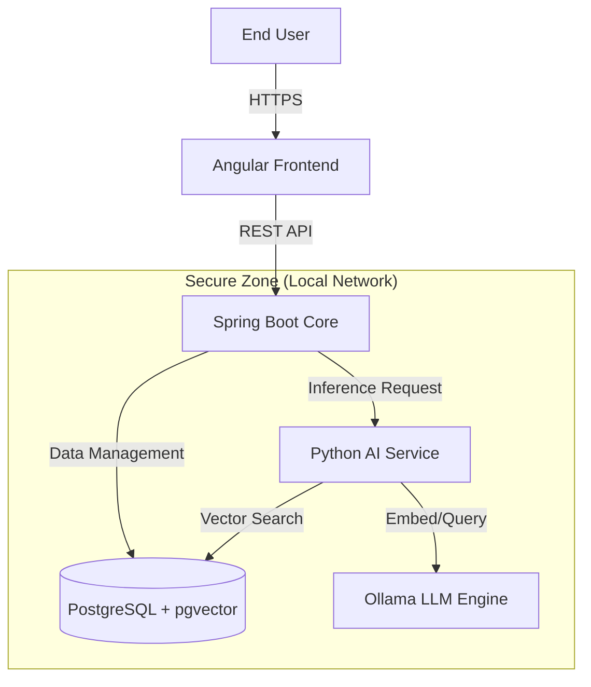

# SecureDoc Intelligence (Local RAG)


## 📄 Abstract
SecureDoc Intelligence is a privacy-first, offline-capable Retrieval-Augmented Generation (RAG) system designed for sensitive corporate environments (e.g., Banking, SME). It enables intelligent document querying without external cloud dependencies, ensuring complete data sovereignty and compliance with strict privacy standards.

## 🏗 Architecture Principle
The system follows a modular microservices architecture, leveraging the "best tool for the job" philosophy:
- **Java (Spring Boot)** for robust business logic, security, and orchestration.
- **Python (FastAPI)** for high-performance AI/ML operations and vector mathematics.
- **PostgreSQL (pgvector)** as a unified store for relational data and high-dimensional vector embeddings.

### Architecture Diagram


## 🛠 Technology Stack

### Backend Core
- **Framework**: Spring Boot 3.x
- **Language**: Java 17+
- **Responsibility**: Orchestration, User Management, Document Processing (Apache PDFBox), API Gateway.

### AI Worker Service
- **Framework**: FastAPI
- **Language**: Python 3.11+
- **Libraries**: LangChain, Sentence-Transformers, PyTorch.
- **Responsibility**: Embedding generation, Context retrieval, LLM interfacing.

### Persistence Layer
- **Database**: PostgreSQL 16
- **Extension**: `pgvector` for vector similarity search (HNSW/IVFFlat).
- **Rationale**: Unified ACID-compliant storage for both metadata and embeddings.

### Frontend
- **Framework**: Angular 16+
- **Styling**: TailwindCSS / SCSS
- **Responsibility**: Reactive UI for document upload and chat interface.

### Infrastructure & LLM Runtime
- **Runtime**: Docker & Docker Compose
- **LLM Engine**: Ollama (Running Llama-3 / Mistral locally)
- **Deployment**: Fully containerized for "Air-Gapped" capability.

## 🚀 Getting Started

### Prerequisites
- Docker & Docker Compose
- 4GB+ RAM for local LLM inference

### Installation
1. Clone the repository
2. Start the infrastructure:
   ```bash
   docker-compose up -d
   ```
3. Initialize the LLM:
   ```bash
   docker exec -it securedoc-ollama ollama run llama3
   ```

## 🗺 Roadmap
- [ ] **Phase 1**: Infrastructure Setup (Docker, Postgres, Ollama)
- [ ] **Phase 2**: AI Worker Service (Python/FastAPI) Implementation
- [ ] **Phase 3**: Vector Database Schema Design
- [ ] **Phase 4**: Spring Boot Orchestrator Implementation
- [ ] **Phase 5**: Angular Frontend Development

---
*Designed for privacy. Built for performance.*
