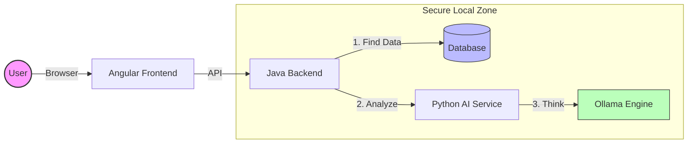
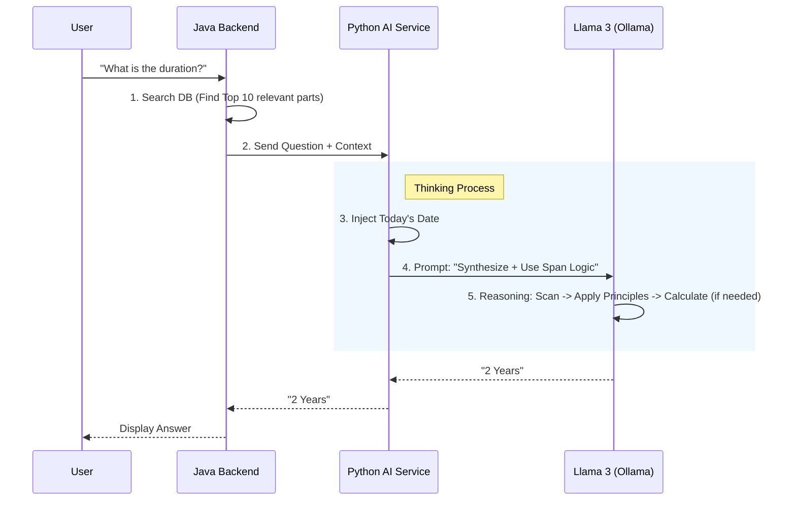

# SecureDoc Intelligence (Local RAG)


## 📄 Overview
SecureDoc Intelligence is a secure tool to chat with your documents. It works completely offline. Your data never leaves your computer. This makes it safe for sensitive contracts, financial reports, or personal files.

## 🏗 Operations Principle
We use a simple and strong setup:
- **Java**: The Boss. Manages files, security, and talks to the user.
- **Python**: The Brain. Handles the AI thinking and math.
- **PostgreSQL**: The Memory. Stores your documents.

### Architecture Diagram


## 🧠 How it Works (The "Life of a Request")

Imagine you upload a **Project Contract** and ask:
> **"What is the total duration of the project?"**

Here is exactly what happens technically:

### Step 1: Search (Java Backend)
The AI cannot read every single document you own at once (that would be too slow).
Instead, the system finds the **Top 10 most relevant text fragments** (paragraph chunks) from your database.
1.  **Vector Search**: It converts your question into numbers to find best matches.
2.  **Deduplication**: It cleans the results.
3.  **Result**: We give the AI only the exact pages it needs to answer.

### Step 2: Date Injection (Python Logic)
Before asking the AI, Python calculates the **Reference Date** (Today).
*   *Why?* If the text says "The project is currently ongoing", the AI needs to know what "Currently" means.
*   *How it connects*: This date is added to the **Prompt** in Step 3 so the AI has an anchor point.

### Step 3: The "Generic Principles" Prompt
We give the AI a **Generic Behavioral Guideline** that works for *any* analytic question:
*   **"Synthesize ALL Info"**: Don't just look at the first match. Look at the whole picture to avoid missing early data points.
*   **"Span Logic"**: A general principle for timelines: If measuring a total, find the *Absolute Start* and *Absolute End* rather than summing up parts (which creates errors).

### Step 4: AI Reasoning (Llama 3)
The AI now acts like a smart analyst:
1.  **Scan**: It reads the 10 text chunks from Step 1.
2.  **Context**: It uses the Date from Step 2 to understand relative time.
3.  **Apply Principles**: It follows the guideline from Step 3.
4.  **Conditional Calculation**: *If* the question asks for a number (time, cost), it performs the calculation. *If* it's just a summary, it summarizes.
5.  **Answer**: It writes the final response in plain English.

### Process Flow


## 🛠 Tech Stack

### Backend (The Boss)
- **Spring Boot 3 (Java)**: The main controller.
- **Job**: It keeps everything organized and safe.

### AI Worker (The Brain)
- **FastAPI (Python)**: The smart worker.
- **Job**: It converts text into numbers (vectors) and talks to the AI model.

### Database (The Memory)
- **PostgreSQL**: The storage.
- **Job**: Keeps your documents safe and searchable.

### Infrastructure (The Engine)
- **Docker**: Runs everything in containers.
- **Ollama**: Runs the Llama 3 model on your local computer (fast & offline).

## 🚀 How to Start

### Requirements
- Docker installed on your computer.
- At least 4GB RAM to run the AI model.

### Steps
1. Clone this project.
2. Start the system:
   ```bash
   docker-compose up -d
   ```
3. Download the AI model:
   ```bash
   docker exec -it securedoc-ollama ollama run llama3
   ```

---
*Built for privacy. Powered by local AI.*
