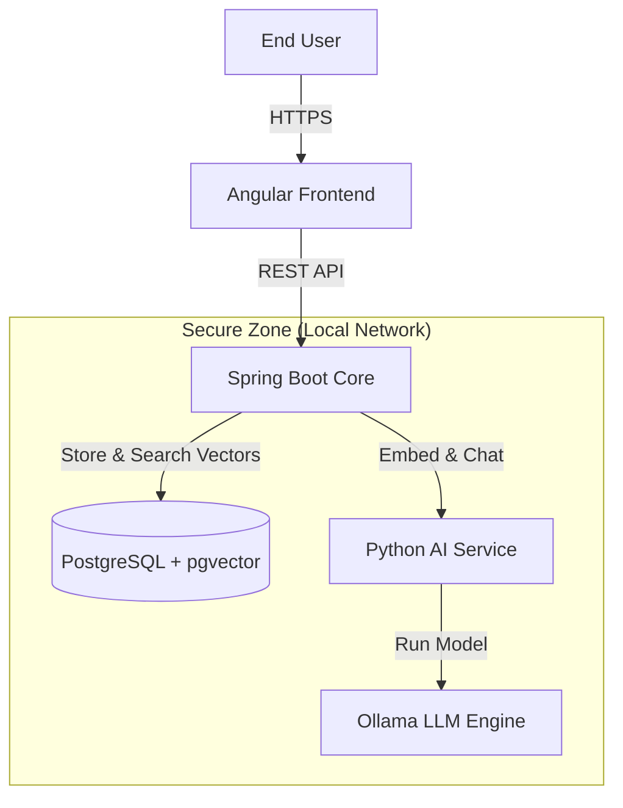

# SecureDoc Intelligence (Local RAG)


## 📄 Overview
SecureDoc Intelligence is a secure, offline tool that helps you chat with your documents. It uses "Retrieval-Augmented Generation" (RAG) to find answers in your PDFs without sending data to the internet. This makes it perfect for sensitive data in banks or companies where privacy is key.

## 🏗 Operations Principle
We use a simple and strong setup:
- **Java (Spring Boot)**: Handles the main logic, user uploads, and security.
- **Python (FastAPI)**: Runs the AI and math parts (Embeddings).
- **PostgreSQL (pgvector)**: Stores your data and the "vector" numbers for search.

### Architecture Diagram


## 🛠 Tech Stack

### Backend (The Boss)
- **Framework**: Spring Boot 3.x (Java 17+)
- **Job**: Orchestrates everything. Manages users, files, and the database (Postgres). It calls the AI Worker for calculations but keeps the state itself.

### AI Worker (The Brain)
- **Framework**: Python FastAPI
- **Job**: Stateless Compute Unit. Converts text into vectors and interfaces with the LLM. It has NO direct database access.

### Database (The Memory)
- **System**: PostgreSQL 16 with `pgvector`
- **Job**: Stores documents and vectors. Managed exclusively by the Java Backend.

### Frontend (The Face)
- **Framework**: Angular 16+
- **Job**: A nice website to upload files and chat.

### Infrastructure (The Engine)
- **Tools**: Docker & Docker Compose
- **AI Model**: Ollama (Running Llama-3 locally)
- **Feature**: It runs completely offline ("Air-Gapped").

## 🚀 How to Start

### Requirements
- Docker installed on your computer.
- At least 4GB RAM to run the AI model.

### Steps
1. Clone this project.
2. Start the system:
   ```bash
   docker-compose up -d
   ```
3. Download the AI model:
   ```bash
   docker exec -it securedoc-ollama ollama run llama3
   ```

## 🗺 Roadmap
- [ ] **Phase 1**: Setup (Docker, Database, AI Engine)
- [ ] **Phase 2**: AI Worker (Python Service)
- [ ] **Phase 3**: Database Schema (Tables)
- [ ] **Phase 4**: Main Backend (Java Spring Boot)
- [ ] **Phase 5**: User Interface (Angular)

---
*Built for privacy. Powered by local AI.*
